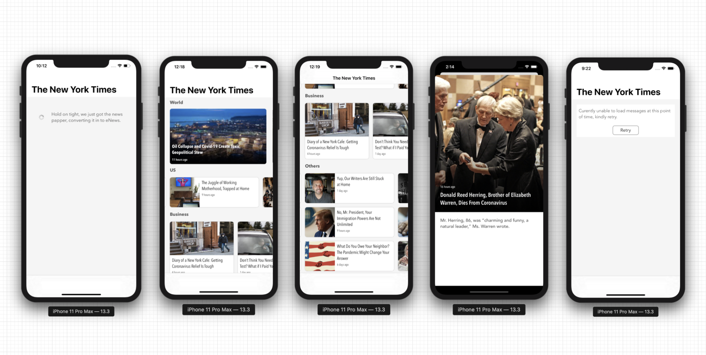
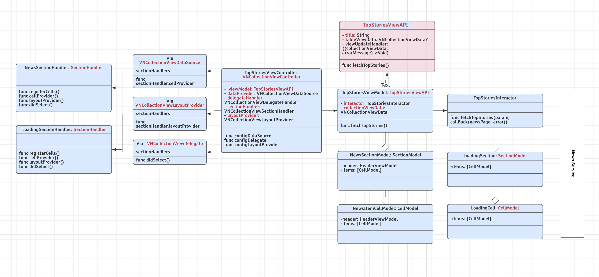

# NewsApp



## VNews App Design Document

### 1.0 App architecture & Components 
The news app components are separated in 3 layers, namely features, platform and core. 
Core layer contains the frameworks which are basically common reusable components, which can be reused with other apps as well, platform layer as name suggests these are the reusable components which is specific to news app and used across the news app, feature layer contains the frameworks which are specific to the app features mostly not shared components. 
The below table shows all the VNews app frameworks which are segregated by the above 3 layers as explained.

| **Features** |   |
| ------------- | ------------- |
| TopStoriesUI.framework  | NewsDetailsUI.framework  |
| **Platform** |   |
| NewsService.framework   | AppConfigService         |
| **Core** |   |
| Plugin.framework | NewsShared.framework	 |

The app overall uses the plugin-based architecture, each and every view or service component is accessed via PluginManager.plugger, a quick example code for accessing the TopStoriesViewController is as shown below


```
    func topStoriesViewController() -> UIViewController? {
        guard let topStoriesPlugin = PluginManager.shared.plugin(for: TopStoriesUIPluginId)?.plug() as? TopStoriesUIAPI,
            let storiesView = topStoriesPlugin.topStoriesViewController(pageId: "home") else { return nil }
        return storiesView
    }
```


That’s with the high-level app architecture and initial flow landing to TopStoriesUI, let's check how the TopStoriesUI TopStoriesViewController is designed 

### 2.0 VSCollectionKit 

TopStoriesViewController uses reusable VSCollectionViewController from VSCollectionKit.framework which is used from https://github.com/Vinodh-G/VSCollectionKit, let's dig little on VSCollectionKit and related components first before getting into the TopStoriesViewController.
VSCollectionKit is handy framework supporting funtionality of a UICollectionView or UICollectionViewController with much easier than way we work with UICollectionView, and avoiding a lot of collectionView related code hazzles and duplicates. 
for more detail on how to use is mentioned in the GitHubLink

### 3.0 TopStoriesUI
TopStoriesHomePage basic design is quite similar to MVVM + mix and match of few viper components, as mentioned earlier it is a subclass of reusable VSCollectionViewController along with that it uses the ViewModel called TopStoriesViewModel of type TopStoriesViewAPI, which contains the core logic of rendering the news based on the categories on the view working along with VSCollectionViewDataSource, as VSCollectionViewDataSource uses MVVM components for section and cell, the  TopStoriesViewModel uses the same for its NewsSectionModel and NewsCellModel, the below class diagram shows how the  TopStoriesViewController and its components working model.



I know the image is quite small, feel free to open the image and check the class diagram.

Rest everything as explained in the VSCollectionViewController, the LoadingCell and NewsItemCell are created from respective sectionHandlers like LoadingSectionHandler and NewsSectionHandler, topStoriesviewModel fetches the news page from TopStoriesInteractor which internally uses NewsService framework to fetch a news page from web, topStoriesViewModel converts the NewsPageResponse into a  VSCollectionViewData containing the news in different category from responses in the form of NewsSectionModel and NewsItemCellModel, and gives it to TopStoriesViewController, the view controller applies the VSCollectionViewData to VSCollectionViewDataSource, which internally handles the connection of data and cell.

The UI uses UICompositionalCollectionViewLayout, which means we are using a single collection view for supporting 4 different layouts, as we are using different section handler for different types of sections, each section handler responsible for providing specific layout information and filled UICollectionViewCell for that particular section, and also the section handler is also responsible to handle the actions when user interacts with cell, the interaction can be with context of same UI or navigating to different UI or service. 


### 4.0 NewsService
The UI uses UICompositionalCollectionViewLayout, which means we are using a single collection view for supporting 4 different layouts, as we are using different section handler for different types of sections, each section handler responsible for providing specific layout information and filled UICollectionViewCell for that particular section, and also the section handler is also responsible to handle the actions when user interacts with cell, the interaction can be with context of same UI or navigating to different UI or service. 

The below screenshots show all the cells used in the TopStoriesViewController and associated section handlers who is responsible for the cell. 

### 5.0 NewsDetailsUI 
This framework is from feature layer, it provides the UI for News Details Screen, this is very simple screen which shows the details of news item when clicked form topstoriesUI home page, the NewsDetailsViewController is also subclass of VNCollectionViewController so it work quite similar to TopStoriesViewController, there was lot of confusion when I started this screen since this is a simple screen with 4 details (News Image, Title, Brief Description, and Published Time) should I use a simple UIViewController with labels and imageView or use UIViewController with vertical StackView, Then I realized I spend a little extra time on making a VNCollectionViewController as reusable components, why not I try the same reusability on the  NewsDetailsViewController, I where I ended up using it as subclass of VNCollectionViewController, because of it we ended up making a lot of classes with functionalities, but I believe it makes it componentized and less dependent, and easy to enhance each components without affecting the others  

Since the design pattern is quite similar to TopStoriesViewController, I have not shown the class diagram specific to NewsDetailsViewController.


